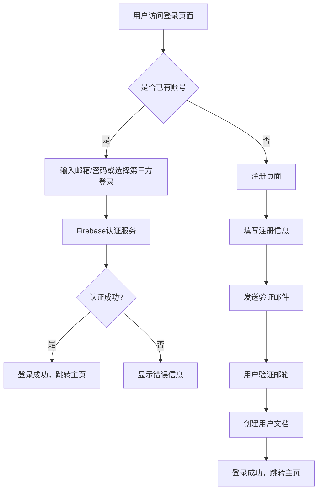

# 潜水潜点推荐平台开发文档

## 一、项目概述

### 1.1 产品定位

潜水潜点推荐平台是一个面向全球潜水爱好者的综合性服务平台，旨在为用户提供全面、准确、最新的潜水潜点信息，帮助潜水爱好者发现世界各地的优质潜点，规划潜水行程，分享潜水经验。平台将整合全球知名潜点数据，提供多维度搜索和筛选功能，并为每个潜点提供详细的介绍、生物观察指南和风险提示，同时构建活跃的潜水社区，促进潜水爱好者之间的交流和互动。

### 1.2 目标用户

本平台主要面向以下几类用户：


*   **入门级潜水爱好者**：需要清晰的潜点难度分级、基础安全提示和适合新手的潜点推荐

*   **经验丰富的潜水员**：寻求具有挑战性的潜点、独特生物观察机会和深度技术潜水信息

*   **潜水旅行规划者**：需要整合交通、住宿、潜店等配套服务信息的一站式解决方案

*   **潜水内容创作者**：寻找高质量素材来源和分享平台的摄影师、作家等

### 1.3 核心价值主张


*   **全面的潜点数据库**：整合全球潜点信息，提供从基础数据到深度详情的一站式查询服务

*   **智能推荐系统**：基于用户偏好、潜水等级和历史行为的个性化潜点推荐

*   **安全可靠的信息**：提供权威的风险评估、生物特性和环境数据，保障潜水安全

*   **活跃的潜水社区**：构建潜水爱好者交流平台，促进经验分享和社交互动

*   **便捷的行程规划**：整合潜点周边服务信息，简化潜水旅行规划流程

## 二、功能架构与优先级规划

### 2.1 核心功能模块

根据开发资源限制和用户需求优先级，将功能分为三个开发阶段：


| 优先级   | 功能模块    | 核心子功能                 | 开发周期 |
| ----- | ------- | --------------------- | ---- |
| 最高优先级 | 用户系统    | 注册登录、个人资料管理、收藏与足迹记录   | 2 周  |
| 最高优先级 | 潜点地图与搜索 | 全球地图展示、多维度搜索与筛选、潜点详情页 | 4 周  |
| 最高优先级 | 基础内容展示  | 潜点基础信息、生物特色、风险提示      | 3 周  |
| 次高优先级 | 社区互动    | 用户评论、潜水日志、图片分享        | 4 周  |
| 次高优先级 | 移动端适配   | 响应式设计、移动优化功能、PWA 支持   | 3 周  |
| 中等优先级 | 高级搜索与推荐 | 智能推荐、相似潜点推荐、个性化推荐     | 4 周  |
| 中等优先级 | 第三方服务集成 | 地图服务、支付接口、外部数据同步      | 3 周  |
| 低优先级  | 高级数据分析  | 用户行为分析、潜点热度分析、生物分布统计  | 待定   |
| 低优先级  | 商业化功能   | 付费会员、广告系统、合作伙伴推广      | 待定   |

### 2.2 核心功能详细设计

#### 2.2.1 用户系统

**注册与登录**：


*   支持邮箱、手机号、第三方账号（微信、Google、Facebook）注册登录

*   登录状态管理（记住密码、自动登录、安全退出）

*   验证码 / 邮箱验证机制防止恶意注册

*   密码重置与账户安全设置

**个人中心**：


*   个人资料管理：昵称、头像、潜水等级 / 证级别、潜水经验年限

*   我的收藏：标记心仪潜点，支持分类管理（如 "待去"、"已去"、"最爱"）

*   我的足迹：记录已潜水的潜点，可添加时间、体验评分和简短评论

*   账号安全管理：密码修改、绑定信息管理、登录日志查看

*   潜水等级认证：允许上传潜水证书照片进行认证

#### 2.2.2 潜点地图与搜索系统

**全球潜点地图**：


*   基于 Mapbox/Google Maps 的交互式地图界面

*   支持缩放、平移、切换卫星 / 标准模式等基本地图操作

*   潜点标记采用不同颜色区分难度等级（初级 / 中级 / 高级）

*   地图筛选功能：可按 "国家 / 地区"、"潜水类型"、"特色生物" 等快速圈选

*   点击标记显示弹窗：包含潜点名称、难度、最佳季节等核心信息，支持跳转详情页

**多维度搜索功能**：


*   基础搜索：按潜点名称、国家 / 城市关键词搜索

*   高级筛选：


    *   地区筛选：分国家 / 大洲筛选（如 "印尼→巴厘岛"、"埃及→红海"）

    *   潜水类型：休闲潜水、技术潜水、洞穴潜水、沉船潜水等

    *   特色筛选：微距生物、大型生物（鲸鲨、蝠鲼）、珊瑚礁等

    *   难度分级：初级（适合新手）、中级（有经验）、高级（专业级）

    *   最佳季节：按月份筛选（如 "10-12 月适合潜水的潜点"）

    *   水温范围：按摄氏度或华氏度范围筛选

    *   能见度：按能见度范围筛选

#### 2.2.3 潜点详情页

**基础信息展示**：


*   地理位置：精确到具体岛屿 / 海域，附坐标、交通方式（如何到达）

*   环境数据：平均水深、最大水深、能见度范围、水温范围、水流强度

*   最佳潜水时间：分月份推荐，说明季节差异和影响因素

*   潜水类型标签：如 "峭壁潜水"、"沉船潜水"、"夜潜" 等

**特色生物与景观**：


*   生物列表：详细列举该潜点常见 / 独特海洋生物，附图片 + 简介

*   生物观察季节：标注不同生物的活跃季节和概率

*   景观描述：珊瑚种类、沉船历史、地形特征（峭壁、洞穴、沙地等）

*   特色景观图片展示：用户上传或官方提供的高质量图片

**风险提示**：


*   自然风险：强水流时段、水温骤变、暗流区域、台风 / 季风影响

*   生物风险：有毒生物（如狮子鱼、海蛇）、攻击性生物（如鲨鱼活动频率）

*   操作风险：下潜点入口难度、上升路径复杂度、特殊技能要求

*   风险等级标识：根据综合风险因素给出低、中、高风险等级

**周边配套信息**：


*   潜店信息：附近推荐潜店，包括名称、联系方式、服务内容

*   住宿餐饮：周边酒店、餐厅推荐，包含距离、价格区间和评分

*   其他设施：医疗站（特别是具备潜水事故急救能力的）、加油站等

#### 2.2.4 社区互动功能

**用户内容分享**：


*   潜水日志发布：用户可发布某潜点的潜水体验，包含文字、图片 / 视频

*   日志内容包括：潜水日期、水温、能见度、生物观察记录、个人感受和评分

*   评论互动：潜点详情页和潜水日志支持评论功能

*   问答系统：用户可提问关于潜点的问题，其他用户或管理员可回答

*   图片 / 视频库：用户上传的潜点实拍内容，按 "生物"、"景观" 分类展示

**排行榜与推荐**：


*   热门潜点榜：按用户收藏量、访问量、评分综合排序

*   最新日志榜：最近发布的优质潜水日志展示

*   相似潜点推荐：基于当前潜点的特征推荐类似潜点

*   个性化推荐：基于用户历史行为和偏好的潜点推荐

#### 2.2.5 移动端适配

**响应式设计**：


*   采用移动优先的设计理念，确保在手机、平板等设备上的良好显示

*   简化导航菜单，采用汉堡菜单等移动端友好的交互方式

*   优化触摸目标大小，确保操作便捷

*   图片和内容布局适应不同屏幕尺寸

**移动专属功能**：


*   离线缓存：重要潜点信息可缓存以便离线查看

*   位置感知：基于 GPS 的附近潜点发现功能

*   一键分享：方便将潜点信息分享到社交媒体

*   移动支付：支持移动端支付购买相关服务（如高级会员）

**PWA 支持**：


*   实现渐进式 Web 应用，支持添加到主屏幕

*   离线访问基本功能

*   推送通知：新日志提醒、潜点更新通知等

## 三、技术架构设计

### 3.1 开发框架选择

根据 AI 工具实现能力和一人开发团队的特点，选择以下技术栈：

**前端框架**：


*   **Next.js**：作为主要开发框架，利用其 SSR（服务器端渲染）和 SSG（静态站点生成）能力，提高性能和 SEO

*   **React.js**：用于构建用户界面组件，配合 Next.js 实现动态交互

*   **TypeScript**：提供类型安全，提高代码质量和可维护性

*   **Shadcn/ui**：基于 Radix UI 和 Tailwind CSS 的组件库，快速构建美观且功能完善的 UI 组件

**后端服务**：


*   **Firebase**：作为 BaaS（后端即服务）平台，提供数据库、认证、存储等核心功能

*   **Firestore**：作为主要数据库，存储潜点信息、用户数据、社区内容等

*   **Cloud Functions**：实现后端逻辑，如数据处理、第三方 API 集成等

*   **Firebase Hosting**：用于部署前端应用，提供 CDN 支持和自动构建部署功能

**地图服务**：


*   **Mapbox**：提供交互式地图展示和地理编码功能

*   **Google Maps API**：备用地图方案，提供更广泛的全球覆盖和街景功能

**AI 工具集成**：


*   **Cursor**：用于辅助代码生成和开发

*   **Firebase AI Logic**：提供生成式 AI 模型集成能力，用于内容生成和智能推荐

*   **Microsoft AutoGen**：用于构建多代理系统，实现复杂的 AI 交互逻辑

### 3.2 数据库设计

**Firestore 数据模型**：


```
users (集合)

&#x20; user\_id (文档)

&#x20;   email: string

&#x20;   name: string

&#x20;   avatar: string

&#x20;   level: string

&#x20;   experience: number

&#x20;   certifications: array

&#x20;   favorites: array

&#x20;   logs: array

dive\_sites (集合)

&#x20; site\_id (文档)

&#x20;   name: string

&#x20;   location: geopoint

&#x20;   country: string

&#x20;   region: string

&#x20;   description: string

&#x20;   difficulty: string

&#x20;   type: array

&#x20;   depth\_avg: number

&#x20;   depth\_max: number

&#x20;   visibility: number

&#x20;   temperature: number

&#x20;   current: string

&#x20;   best\_season: array

&#x20;   features: array

&#x20;   risks: array

&#x20;   creatures: array

&#x20;   images: array

&#x20;   coordinates: array

&#x20;   access: string

&#x20;   nearby\_accommodation: array

&#x20;   nearby\_shops: array

&#x20;   nearby\_medical: array

&#x20;   rating: number

&#x20;   reviews\_count: number

reviews (集合)

&#x20; review\_id (文档)

&#x20;   user\_id: string

&#x20;   site\_id: string

&#x20;   rating: number

&#x20;   comment: string

&#x20;   created\_at: timestamp

logs (集合)

&#x20; log\_id (文档)

&#x20;   user\_id: string

&#x20;   site\_id: string

&#x20;   date: date

&#x20;   visibility: number

&#x20;   temperature: number

&#x20;   creatures\_seen: array

&#x20;   experience: string

&#x20;   images: array

&#x20;   rating: number

&#x20;   comments: array

creatures (集合)

&#x20; creature\_id (文档)

&#x20;   name: string

&#x20;   scientific\_name: string

&#x20;   description: string

&#x20;   images: array

&#x20;   sighting\_seasons: array

&#x20;   dive\_sites: array

&#x20;   risk\_level: string
```

**数据关系说明**：


*   用户 (users) 与潜点 (dive\_sites) 之间通过 "收藏" 和 "日志" 建立关联

*   潜点 (dive\_sites) 与生物 (creatures) 之间是多对多关系

*   评论 (reviews) 和日志 (logs) 是用户对潜点的反馈和记录

*   每个文档都包含必要的元数据，如创建时间、更新时间等

*   使用地理点 (geopoint) 类型存储潜点位置，便于地理查询

### 3.3 第三方服务集成

**核心第三方服务**：


1.  **Firebase 服务**：

*   Firebase Authentication：提供用户认证和授权服务

*   Firestore：提供云数据库服务

*   Cloud Storage：用于存储用户上传的图片和视频

*   Cloud Functions：用于实现后端业务逻辑和第三方 API 集成

*   Firebase AI Logic：用于集成生成式 AI 模型

1.  **地图服务**：

*   Mapbox SDK：用于实现交互式地图界面

*   Google Maps API：作为备用地图方案

1.  **数据获取 API**：

*   World Scuba Diving Sites API：提供全球潜点基础数据

*   NOAA 海洋气象数据：提供海洋气象和水文数据

*   FishBase 数据库：提供海洋生物信息

1.  **内容审核服务**：

*   Google Cloud Vision API：用于检测用户上传图片中的不当内容

*   Perspective API：用于检测用户生成文本中的毒性内容

1.  **支付服务**：

*   Stripe：提供支付处理功能（用于未来的付费会员服务）

**第三方服务集成策略**：


*   优先使用 Firebase 生态系统内的服务，减少集成复杂度

*   关键服务设置备用方案，确保系统高可用性

*   对外部 API 调用实施速率限制和缓存策略，避免超出使用限制

*   设计数据同步机制，确保外部数据更新时系统内容保持最新

### 3.4 移动端适配策略

**移动优先设计原则**：


*   采用响应式网格系统，确保界面在不同设备上的一致性

*   使用相对单位（如 rem、em）而非绝对单位（如 px）进行布局

*   简化导航菜单，采用移动端友好的交互模式（如汉堡菜单）

*   优化图像资源，使用 Next.js 内置的图像优化组件自动生成不同尺寸的图像

**性能优化**：


*   使用 Next.js 的静态生成（SSG）和服务器端渲染（SSR）技术，提高页面加载速度

*   实现代码分割，减少初始加载的代码量

*   利用浏览器缓存和 HTTP 缓存策略，提高重复访问的性能

*   实现 PWA（渐进式 Web 应用）功能，支持离线访问和后台同步

**移动专属功能**：


*   实现基于 GPS 的附近潜点发现功能

*   优化触摸目标大小，确保操作便捷

*   实现移动端优化的表单输入（如日期选择器、滑块等）

*   提供离线缓存功能，允许用户下载重要潜点信息供离线查看

**PWA 实现**：


*   使用 Next.js 的内置 PWA 支持

*   实现应用安装提示

*   配置离线缓存策略，确保关键页面和资源可离线访问

*   实现后台同步功能，确保离线数据在恢复连接后自动同步

## 四、开发路线图与优先级

### 4.1 第一阶段（核心功能实现）

**核心目标**：完成平台最小可行产品（MVP），实现基本功能，确保核心用户体验

**开发内容**：


1.  **用户系统基础功能**（2 周）

*   用户注册 / 登录（邮箱、第三方登录）

*   个人资料管理

*   登录状态管理

1.  **潜点地图与搜索系统**（4 周）

*   基于 Mapbox 的地图展示

*   基本搜索功能（按名称、国家搜索）

*   潜点标记与信息弹窗

*   基础潜点信息展示

1.  **潜点详情页**（3 周）

*   潜点基础信息展示

*   难度分级和潜水类型展示

*   特色生物与景观介绍

*   风险提示信息

1.  **初始数据填充**（2 周）

*   全球 Top 100 潜点基础数据录入

*   常见海洋生物信息录入

*   基础风险类型和提示信息

**关键里程碑**：


*   完成 MVP 版本，可展示基本潜点信息和地图

*   用户可注册登录并查看潜点详情

*   实现基本的搜索和筛选功能

*   完成初始数据填充，平台具备基本可用性

### 4.2 第二阶段（社区功能增强）

**核心目标**：增强社区互动功能，提高用户粘性和平台活跃度

**开发内容**：


1.  **社区互动系统**（4 周）

*   用户评论和评分系统

*   潜水日志发布功能

*   图片 / 视频上传和管理

*   社区互动（点赞、评论、分享）

1.  **个人中心增强**（2 周）

*   我的收藏管理

*   我的足迹记录

*   潜水日志管理

1.  **搜索功能增强**（2 周）

*   高级筛选功能（难度、类型、生物等）

*   多条件组合搜索

*   搜索结果排序功能

1.  **移动端适配**（3 周）

*   响应式设计优化

*   移动专用交互组件

*   触摸友好界面调整

**关键里程碑**：


*   社区功能上线，用户可分享潜水经验和评论

*   平台具备完整的用户互动能力

*   实现高级搜索功能，提升用户发现潜点的效率

*   完成移动端适配，确保跨设备一致性体验

### 4.3 第三阶段（高级功能与优化）

**核心目标**：提升平台智能化水平，优化用户体验，扩大数据覆盖

**开发内容**：


1.  **AI 功能集成**（4 周）

*   基于 Firebase AI Logic 的内容生成功能

*   智能推荐系统（潜点推荐、生物匹配）

*   自然语言搜索功能

1.  **数据管理与更新**（3 周）

*   第三方数据自动同步机制

*   用户生成内容审核系统

*   数据质量监控和反馈机制

1.  **高级用户功能**（3 周）

*   潜水等级认证系统

*   个性化设置和偏好管理

*   行程规划工具

1.  **系统性能优化**（2 周）

*   页面加载速度优化

*   数据库查询优化

*   缓存机制实现

**关键里程碑**：


*   AI 功能上线，提升平台智能化水平

*   数据管理系统完善，确保内容准确性和时效性

*   系统性能优化完成，用户体验显著提升

*   平台功能全面，能够满足不同层次潜水爱好者的需求

### 4.4 第四阶段（商业化与扩展）

**核心目标**：探索商业化模式，扩大用户基础，提升品牌影响力

**开发内容**：


1.  **商业化功能**（4 周）

*   付费会员系统

*   广告投放系统

*   合作伙伴推广功能

1.  **内容扩展**（4 周）

*   更多潜点数据收集和录入

*   详细的生物观察指南

*   潜点周边服务信息扩展

1.  **国际化支持**（3 周）

*   多语言支持（英语、中文、西班牙语等）

*   地区针对性内容和推荐

*   本地化用户体验优化

1.  **高级分析功能**（3 周）

*   用户行为分析系统

*   潜点热度分析

*   生物分布统计分析

**关键里程碑**：


*   商业化模式确立，开始产生收入

*   内容覆盖大幅扩展，成为行业领先的数据平台

*   完成国际化布局，用户群体显著扩大

*   数据分析系统完善，为业务决策提供有力支持

## 五、核心功能开发方案

### 5.1 用户认证与授权系统

**认证流程设计**：




**实现方案**：


*   使用 Firebase Authentication 作为认证服务核心

*   实现邮箱 / 密码认证、第三方账号认证（微信、Google、Facebook）

*   采用 JWT（JSON Web Tokens）进行身份验证和授权

*   实现基于角色的访问控制（如普通用户、管理员）

*   集成 Google reCAPTCHA 防止机器人注册

**关键技术点**：


*   使用 next-firebase-auth-edge 库简化 Next.js 与 Firebase 认证的集成

*   实现自定义登录 UI，保持与平台整体设计一致

*   设计安全的密码重置流程

*   实现用户会话管理和安全退出功能

### 5.2 潜点地图展示与搜索系统

**地图系统架构**：


```
Mapbox SDK (前端)

&#x20; ↓

Firebase Cloud Functions (后端)

&#x20; ↓

Dive Sites API (第三方)
```

**实现方案**：


*   基于 Mapbox GL JS 构建交互式地图界面

*   使用 Mapbox Geocoding API 实现地址搜索和地理编码

*   在地图上渲染潜点标记，使用不同颜色和图标区分难度等级

*   实现地图点击事件，弹出潜点信息窗口

*   实现基于地理位置的搜索和筛选功能

**搜索功能实现**：


*   基础搜索：基于潜点名称和地理位置的全文搜索

*   高级搜索：基于难度、类型、生物、季节等多条件组合搜索

*   实现搜索建议和自动完成功能

*   搜索结果分页显示，支持排序和筛选

**关键技术点**：


*   使用 Firestore 的地理查询功能实现附近潜点搜索

*   实现搜索关键词的模糊匹配和拼写纠正

*   对频繁搜索的结果进行缓存，提高响应速度

*   设计高效的查询索引，优化搜索性能

### 5.3 潜点详情页实现

**详情页信息架构**：


```
潜点基本信息

&#x20; \- 名称、位置、难度、类型

&#x20; \- 环境数据（水深、能见度、水温等）

&#x20; \- 最佳潜水季节

特色生物与景观

&#x20; \- 生物列表（图片、名称、简介）

&#x20; \- 景观描述（图片、类型、特点）

风险提示

&#x20; \- 自然风险

&#x20; \- 生物风险

&#x20; \- 操作风险

周边配套

&#x20; \- 住宿推荐

&#x20; \- 潜店信息

&#x20; \- 医疗设施

用户评论与评分

&#x20; \- 评分汇总

&#x20; \- 最新评论

&#x20; \- 评论表单

潜水日志

&#x20; \- 用户分享的日志列表

&#x20; \- 添加新日志表单
```

**实现方案**：


*   使用 Next.js 动态路由实现潜点详情页

*   从 Firestore 获取潜点数据并渲染

*   实现图片轮播展示潜点图片

*   显示用户评论和评分，支持分页显示

*   实现添加评论和日志的表单功能

**关键技术点**：


*   使用 Shadcn/ui 组件构建美观且功能完善的详情页布局

*   实现评论和日志的实时更新，使用 Firestore 的实时数据库功能

*   设计高效的图片加载策略，优化页面性能

*   实现评论和日志的用户身份验证和权限控制

### 5.4 社区互动系统

**用户生成内容架构**：


```
用户 (前端)

&#x20; ↓

Firebase Storage (存储)

&#x20; ↓

Firebase Cloud Functions (处理)

&#x20; ↓

Firestore (数据库)
```

**实现方案**：


*   用户可以发布潜水日志，包含文字、图片和视频

*   实现评论和回复功能，支持多级评论

*   实现点赞和分享功能，增强互动性

*   构建用户贡献排行榜，激励用户参与

*   实现内容举报和审核机制，确保社区内容质量

**内容审核机制**：


*   使用 Google Cloud Vision API 检测图片中的不当内容

*   使用 Perspective API 检测文本中的毒性内容

*   实现自动审核和人工审核相结合的机制

*   对违规内容进行标记和处理，保障社区安全

**关键技术点**：


*   使用 Firebase Storage 存储用户上传的媒体文件

*   使用 Cloud Functions 实现内容审核和处理

*   设计高效的内容检索和展示机制

*   实现用户声誉系统，提高内容质量

### 5.5 数据获取与更新机制

**数据获取途径**：


1.  **第三方 API 集成**：

*   World Scuba Diving Sites API：获取全球潜点基础数据

*   NOAA 海洋数据 API：获取海洋气象和水文数据

*   FishBase 数据库 API：获取海洋生物信息

1.  **网络爬虫**：

*   定期爬取专业潜水论坛和网站，获取最新潜点信息

*   爬取旅游局和保护区官网，获取官方数据

*   爬取社交媒体和社区平台，收集用户生成内容

1.  **用户贡献**：

*   用户提交潜点信息和更新

*   用户上传潜水日志和观察记录

*   专家用户和合作伙伴提供专业数据

**数据更新策略**：


*   对静态数据（如潜点位置、基础信息）设置较长缓存时间

*   对动态数据（如用户评论、评分）实现实时更新

*   对季节性数据（如最佳潜水季节）设置季节性更新触发器

*   对外部 API 数据设置自动同步机制，确保数据新鲜度

**关键技术点**：


*   使用 Cheerio 和 Puppeteer 实现网络爬虫功能

*   对爬取的数据进行清洗和验证，确保数据质量

*   实现数据版本控制，记录数据变更历史

*   设计数据冲突解决机制，处理不同来源的数据差异

## 六、项目管理与实施计划

### 6.1 开发团队与分工

由于开发资源仅为一人，采用以下分工策略：


| 角色    | 职责              | 工具                             |
| ----- | --------------- | ------------------------------ |
| 产品经理  | 需求分析、功能规划、优先级确定 | Figma、Notion                   |
| 设计师   | UI/UX 设计、原型制作   | Figma、Adobe XD                 |
| 开发工程师 | 全栈开发、测试、部署      | Next.js、TypeScript、Firebase    |
| 数据工程师 | 数据获取、处理、集成      | Python、Puppeteer、Cheerio       |
| 质量保证  | 测试、bug 修复、质量控制  | Jest、Cypress、Firebase Test Lab |

**AI 工具辅助**：


*   使用 Cursor 辅助代码生成和开发

*   使用 Firebase AI Logic 生成部分内容

*   使用 AI 工具辅助设计和原型制作

*   使用 AI 工具辅助测试用例生成和测试执行

### 6.2 开发流程与方法

采用敏捷开发方法，结合以下实践：


1.  **两周迭代周期**：

*   每周一进行需求梳理和计划会议

*   每周五进行迭代回顾和成果展示

*   每个迭代专注于完成特定功能模块

1.  **测试驱动开发**：

*   编写单元测试和集成测试确保代码质量

*   使用 Cypress 进行端到端测试

*   实现持续集成和自动化测试

1.  **代码审查**：

*   对关键功能和复杂逻辑进行自我审查

*   使用静态代码分析工具（如 ESLint）提高代码质量

*   定期进行代码重构，保持代码库整洁

1.  **版本控制**：

*   使用 Git 进行版本控制

*   采用 GitHub Flow 工作流程

*   定期备份代码和数据

### 6.3 关键里程碑与时间线


| 阶段   | 关键里程碑           | 预计时间 |
| ---- | --------------- | ---- |
| 第一阶段 | MVP 版本完成，基本功能可用 | 8 周  |
| 第二阶段 | 社区功能上线，用户互动完整   | 12 周 |
| 第三阶段 | AI 功能集成，数据覆盖扩大  | 16 周 |
| 第四阶段 | 商业化模式确立，国际化开始   | 20 周 |

**详细时间线**：


```
第1-2周：用户认证系统开发

第3-4周：地图基础功能实现

第5-6周：潜点详情页开发

第7-8周：初始数据填充，MVP发布

第9-10周：社区评论系统开发

第11-12周：潜水日志功能实现

第13-14周：高级搜索功能开发

第15-16周：移动端适配优化

第17-18周：AI推荐系统集成

第19-20周：数据更新机制实现

第21-22周：内容审核系统开发

第23-24周：国际化初步支持

第25-26周：商业化功能原型

第27-28周：用户分析系统开发

第29-30周：系统优化和性能调优
```

### 6.4 风险管理与应对策略

**技术风险**：


*   **外部 API 不可用**：设计数据缓存和备用数据源，确保系统可用性

*   **技术栈选择不当**：保持技术栈简洁，优先使用成熟解决方案

*   **性能问题**：进行持续性能监控和优化，建立性能基线

**数据风险**：


*   **数据质量问题**：实施数据验证和清洗流程，建立数据质量标准

*   **数据更新延迟**：设计数据同步机制，设置合理的更新频率

*   **数据安全问题**：实施严格的数据安全措施，遵循 GDPR 等法规

**资源风险**：


*   **时间不足**：采用最小可行产品策略，优先核心功能

*   **技能不足**：利用 AI 工具辅助开发，学习必要技能

*   **资金限制**：优先使用免费或低成本服务，实施成本控制策略

**应对策略**：


*   建立风险日志，定期评估和监控风险

*   为关键组件设计冗余和备份方案

*   实施敏捷开发方法，快速响应变化

*   建立完善的测试和质量保障体系

## 七、预算与资源需求

### 7.1 开发资源需求

**软件资源**：


*   Firebase 开发计划：Blaze 计划（按需付费）

*   Mapbox API：基础套餐（免费额度内）

*   第三方 API：根据使用量选择合适的套餐

*   代码托管：GitHub Pro（个人版）

*   设计工具：Figma 个人版

**硬件资源**：


*   开发设备：高性能笔记本电脑

*   测试设备：多种手机和平板设备（可通过模拟器部分替代）

*   服务器资源：由 Firebase 提供，无需额外服务器

**人力资源**：


*   全职开发者：1 人（负责全栈开发）

*   兼职顾问：潜水专家（内容审核和专业建议）

*   兼职数据录入员：初期数据填充阶段需要

### 7.2 成本估算

**开发阶段成本**：


| 项目      | 估算成本        | 备注                       |
| ------- | ----------- | ------------------------ |
| 开发工具与服务 | \$500 / 月   | Firebase、Mapbox、GitHub 等 |
| 数据获取    | \$200 / 月   | 第三方 API 调用、网络爬虫服务等       |
| 内容审核    | \$300 / 月   | 初期人工审核成本                 |
| 测试与质量保证 | \$200 / 月   | 测试工具、设备等                 |
| 顾问费用    | \$500 / 月   | 潜水专家咨询费用                 |
| 总计      | \$1,700 / 月 | 初期开发阶段                   |

**运营阶段成本**：


| 项目   | 估算成本        | 备注            |
| ---- | ----------- | ------------- |
| 基础设施 | \$300 / 月   | Firebase 服务费用 |
| 数据更新 | \$500 / 月   | 第三方 API、数据爬取等 |
| 内容审核 | \$1,000 / 月 | 人工审核和 AI 审核结合 |
| 营销推广 | \$2,000 / 月 | 初期用户获取和推广     |
| 客户支持 | \$500 / 月   | 初期用户支持和反馈处理   |
| 总计   | \$4,300 / 月 | 运营初期阶段        |

**收入预测**：


*   会员订阅：$10/月/用户，预计初期500用户，月收入$5,000

*   广告收入：预计初期 \$1,000 / 月

*   合作伙伴推广：预计初期 \$2,000 / 月

*   总收入：初期预计 \$8,000 / 月

**投资回报分析**：


*   开发阶段（6 个月）总成本：约 \$10,200

*   运营阶段（首年）总成本：约 \$51,600

*   首年总收入预计：\$96,000

*   首年净收益：约 \$34,200

*   投资回收期：约 8 个月

### 7.3 关键成功因素


1.  **数据质量**：

*   确保潜点信息准确、完整、最新

*   建立数据质量控制机制

*   与专业机构和潜水社区合作获取权威数据

1.  **用户体验**：

*   设计直观、易用的界面

*   优化页面加载速度和响应性能

*   提供个性化推荐和定制化体验

1.  **社区活跃度**：

*   鼓励用户分享和互动

*   建立有效的内容激励机制

*   培养核心用户群体和意见领袖

1.  **商业化策略**：

*   提供增值服务和付费会员权益

*   建立可持续的收入模式

*   与潜水行业合作伙伴建立共赢关系

1.  **技术稳定性**：

*   确保系统高可用性和性能

*   建立完善的监控和报警系统

*   实施定期备份和灾难恢复计划

## 八、未来发展规划

### 8.1 短期发展计划（1 年内）


1.  **功能扩展**：

*   实现 AI 驱动的个性化推荐系统

*   开发行程规划和预订功能

*   实现潜水日志分析和统计功能

1.  **内容扩展**：

*   扩大潜点覆盖范围，达到全球 5,000 + 潜点

*   丰富生物数据库，收录更多海洋生物信息

*   增加潜水课程和培训中心信息

1.  **用户增长**：

*   实施用户获取和留存策略

*   建立合作伙伴关系和联盟

*   开展线下活动和潜水旅行团

### 8.2 中期发展计划（1-3 年）


1.  **平台扩展**：

*   开发独立的移动应用（iOS 和 Android）

*   实现多语言支持，拓展国际市场

*   建立潜水装备和服务电商平台

1.  **数据深化**：

*   建立海洋生态数据库，支持科学研究

*   开发生物观察记录和分析工具

*   建立潜水安全知识库和应急响应系统

1.  **商业模式拓展**：

*   开发企业解决方案（潜水中心、旅游公司）

*   提供数据分析和市场洞察服务

*   建立潜水认证和培训体系

### 8.3 长期发展愿景（3-5 年）


1.  **生态系统构建**：

*   成为全球领先的潜水生态系统平台

*   连接潜水产业链各环节

*   推动潜水文化和海洋保护事业发展

1.  **技术创新**：

*   应用 AR/VR 技术提升潜水体验

*   开发潜水数据分析和预测模型

*   探索区块链技术在潜水认证和数据安全中的应用

1.  **社会责任**：

*   建立海洋保护基金会

*   推动可持续潜水实践

*   支持海洋科学研究和教育

## 九、结论与建议

### 9.1 项目可行性评估

本项目具有较高的可行性，主要基于以下因素：


1.  **市场需求**：全球潜水爱好者数量持续增长，对优质潜点信息的需求强烈

2.  **技术可行性**：现有技术栈和工具能够支持项目的核心功能实现

3.  **资源需求**：初期开发资源需求相对可控，可通过分阶段实施控制成本

4.  **商业模式**：多元化的收入来源具有可持续性

### 9.2 关键建议


1.  **最小可行产品策略**：

*   优先开发核心功能，确保 MVP 尽快上线

*   通过用户反馈不断优化和迭代

*   采用渐进式开发策略，逐步扩展功能

1.  **数据获取策略**：

*   建立多渠道数据获取机制

*   优先整合高质量、权威数据源

*   建立数据更新和验证机制

1.  **用户体验优先**：

*   始终将用户体验放在首位

*   进行持续的用户测试和反馈收集

*   优化关键路径和核心流程

1.  **社区建设策略**：

*   积极培育早期用户社区

*   激励用户生成高质量内容

*   建立有效的社区管理和治理机制

1.  **技术实施建议**：

*   采用模块化设计，提高可维护性和可扩展性

*   实施持续集成和持续部署

*   建立完善的监控和日志系统

通过以上规划和策略，潜水潜点推荐平台有望成为潜水爱好者的首选平台，为全球潜水社区提供有价值的服务，同时实现可持续的商业发展。

## 附录：关键技术选型对比

### 数据库选型对比


| 方案         | 优点                    | 缺点                    | 适用性           |
| ---------- | --------------------- | --------------------- | ------------- |
| Firestore  | 无服务器架构、实时数据、易于集成、自动扩展 | 成本较高、查询能力有限、不适合复杂关系查询 | 适合文档型数据，快速开发  |
| PostgreSQL | 强大的查询能力、支持复杂关系、成熟可靠   | 需要服务器管理、扩展复杂、实时性差     | 适合复杂数据模型和高级查询 |
| MongoDB    | 文档型数据库、灵活的数据模型、水平扩展   | 查询性能一般、事务支持有限、管理复杂    | 适合快速迭代和灵活数据模型 |

**推荐方案**：Firestore，因为其无服务器架构、实时数据功能和与 Firebase 生态系统的无缝集成非常适合单人开发者快速构建和迭代应用。

### 地图服务选型对比


| 方案            | 优点                       | 缺点                   | 适用性                  |
| ------------- | ------------------------ | -------------------- | -------------------- |
| Mapbox        | 灵活的自定义地图、强大的 API、优秀的开发文档 | 免费额度有限、复杂功能需要付费      | 适合需要高度自定义地图的应用       |
| Google Maps   | 全球覆盖广、街景功能、强大的地理编码       | 价格较高、自定义能力有限、品牌限制    | 适合需要广泛地理覆盖和街景的应用     |
| OpenStreetMap | 完全免费、开放数据、社区支持           | 数据质量不一、API 功能有限、文档不全 | 适合预算有限且对地图自定义要求不高的应用 |

**推荐方案**：Mapbox 为主，Google Maps 为备用。Mapbox 提供更好的自定义能力和开发者体验，适合构建具有特色的地图界面，而 Google Maps 作为备用方案可提供更广泛的全球覆盖和街景功能。

### 认证服务选型对比


| 方案                      | 优点                        | 缺点                      | 适用性                   |
| ----------------------- | ------------------------- | ----------------------- | --------------------- |
| Firebase Authentication | 无缝集成 Firebase、多种认证方式、简单易用 | 锁定在 Firebase 生态、自定义能力有限 | 适合使用 Firebase 作为后端的应用 |
| Auth0                   | 强大的认证功能、灵活的自定义、支持多种协议     | 成本较高、学习曲线较陡、需要额外设置      | 适合对认证功能要求高的企业级应用      |
| NextAuth.js             | 开源、灵活、支持多种认证提供者           | 需要自行管理、文档不够完善           | 适合需要高度自定义认证流程的应用      |

**推荐方案**：Firebase Authentication，因为其与 Firebase 生态系统的无缝集成，以及对多种认证方式的支持，非常适合快速开发和迭代。

### AI 工具选型对比


| 方案                 | 优点                         | 缺点                    | 适用性                       |
| ------------------ | -------------------------- | --------------------- | ------------------------- |
| Firebase AI Logic  | 与 Firebase 生态集成、简单易用、无需服务器 | 功能有限、模型选择受限、成本较高      | 适合需要简单 AI 功能的 Firebase 应用 |
| OpenAI API         | 强大的模型能力、丰富的功能、优秀的文档        | 成本较高、需要后端服务器、响应时间可能较长 | 适合需要高级 AI 功能的应用           |
| Microsoft Azure AI | 全面的 AI 服务、企业级支持、混合云选项      | 学习曲线陡、成本较高、设置复杂       | 适合大型企业级应用                 |

**推荐方案**：Firebase AI Logic 为主，OpenAI API 为辅。Firebase AI Logic 的无缝集成和易用性非常适合快速实现基本 AI 功能，而 OpenAI API 可作为补充，提供更强大的生成式 AI 能力。

### 前端框架选型对比


| 方案      | 优点                        | 缺点                       | 适用性                     |
| ------- | ------------------------- | ------------------------ | ----------------------- |
| Next.js | 静态生成、服务器端渲染、优化的性能、良好的 SEO | 学习曲线较陡、配置复杂、体积较大         | 适合需要高性能和 SEO 的现代 Web 应用 |
| React   | 灵活、组件化、生态丰富、社区支持强         | 需要额外配置、学习曲线较陡、性能优化需要手动处理 | 适合构建复杂的单页应用             |
| Vue.js  | 轻量、易学、灵活的数据绑定、优秀的性能       | 生态不如 React 丰富、大型应用架构支持有限 | 适合快速开发和轻量级应用            |

**推荐方案**：Next.js，因为其内置的性能优化、SEO 支持和静态生成能力，非常适合构建内容丰富的 Web 应用，同时其与 React 生态的兼容性提供了丰富的组件和库资源。

**参考资料 **

\[1] Top 10 AI Frameworks to Learn in 2025[ https://www.geeksforgeeks.org/blogs/top-artificial-intelligence-frameworks/](https://www.geeksforgeeks.org/blogs/top-artificial-intelligence-frameworks/)

\[2] Top AI Agent frameworks and platforms in 2025[ https://workos.com/blog/top-ai-agent-frameworks-and-platforms-in-2025](https://workos.com/blog/top-ai-agent-frameworks-and-platforms-in-2025)

\[3] Beginner's Guide to Ai Platforms 2025[ https://www.restack.io/p/beginners-guide-to-artificial-intelligence-answer-ai-platforms-2025-cat-ai](https://www.restack.io/p/beginners-guide-to-artificial-intelligence-answer-ai-platforms-2025-cat-ai)

\[4] Top 7 Frameworks for Building AI Agents in 2025[ https://www.analyticsvidhya.com/blog/2024/07/ai-agent-frameworks/](https://www.analyticsvidhya.com/blog/2024/07/ai-agent-frameworks/)

\[5] Top 5 Best AI Agent Frameworks in 2025[ https://www.intuz.com/blog/best-ai-agent-frameworks](https://www.intuz.com/blog/best-ai-agent-frameworks)

\[6] AI Development Tools Uncovered: A Guide for Creators and Innovators[ https://www.moontechnolabs.com/blog/ai-development-tools/](https://www.moontechnolabs.com/blog/ai-development-tools/)

\[7] JavaScript & TypeScript[ https://docs.cursor.com/guides/languages/javascript](https://docs.cursor.com/guides/languages/javascript)

\[8] Guide on Integrating Cursor with Other Coding Platforms to Streamline the Development Process[ https://www.arsturn.com/blog/guide-on-integrating-cursor-with-other-coding-platforms](https://www.arsturn.com/blog/guide-on-integrating-cursor-with-other-coding-platforms)

\[9] cursor[ https://github.com/topics/cursor?l=go](https://github.com/topics/cursor?l=go)

\[10] cursor[ https://github.com/topics/cursor?o=desc\&s=stars](https://github.com/topics/cursor?o=desc\&s=stars)

\[11] Cursor for ARM[ https://github.com/coder/cursor-arm](https://github.com/coder/cursor-arm)

\[12] Integrate Next. js[ https://firebase.google.com/docs/hosting/frameworks/nextjs#:\~:text=Using](https://firebase.google.com/docs/hosting/frameworks/nextjs#:\~:text=Using)

\[13] next-firebase-auth-edge[ https://www.npmjs.com/package/next-firebase-auth-edge](https://www.npmjs.com/package/next-firebase-auth-edge)

\[14] Integrate Firebase with a Next.js app[ https://firebase.google.com/codelabs/firebase-nextjs](https://firebase.google.com/codelabs/firebase-nextjs)

\[15] What's new in Firebase at Cloud Next 2025[ https://firebase.blog/posts/2025/04/cloud-next-announcements](https://firebase.blog/posts/2025/04/cloud-next-announcements)

\[16] Next.js 15 & Firebase[ https://www.udemy.com/course/nextjs-firebase/?srsltid=AfmBOopPds-dDAdxDSz6HF10JeRm0sfvfESGqFZ-q8UTYPh19llsecpE](https://www.udemy.com/course/nextjs-firebase/?srsltid=AfmBOopPds-dDAdxDSz6HF10JeRm0sfvfESGqFZ-q8UTYPh19llsecpE)

\[17] Crawl4Ai[ https://docs.ag2.ai/0.8.4/docs/user-guide/reference-tools/crawl4ai/](https://docs.ag2.ai/0.8.4/docs/user-guide/reference-tools/crawl4ai/)

\[18] Getting started with AutoGen + Neon[ https://neon.tech/guides/autogen-neon](https://neon.tech/guides/autogen-neon)

\[19] AutoGen[ https://www.gettingstarted.ai/tag/autogen/](https://www.gettingstarted.ai/tag/autogen/)

\[20] AutogenAI Announces the Launch of AutogenAI Federal: A Groundbreaking AI-First Proposal and RFP Management Platform for Federal Proposals[ https://salestechstar.com/amp/predictive-ai-artificial-intelligence/autogenai-announces-the-launch-of-autogenai-federal-a-groundbreaking-ai-first-proposal-and-rfp-management-platform-for-federal-proposals/](https://salestechstar.com/amp/predictive-ai-artificial-intelligence/autogenai-announces-the-launch-of-autogenai-federal-a-groundbreaking-ai-first-proposal-and-rfp-management-platform-for-federal-proposals/)

\[21] microsoft/autogen

&#x20;python-v0.7.2[ https://newreleases.io/project/github/microsoft/autogen/release/python-v0.7.2](https://newreleases.io/project/github/microsoft/autogen/release/python-v0.7.2)

\[22] next-fiery-auth[ https://www.npmjs.com/package/next-fiery-auth](https://www.npmjs.com/package/next-fiery-auth)

\[23] Integrate Firebase with a Next.js app[ https://firebase.google.com/codelabs/firebase-nextjs?authuser=2](https://firebase.google.com/codelabs/firebase-nextjs?authuser=2)

\[24] Authenticate with Firebase using Password-Based Accounts using Javascript[ https://firebase.google.com/docs/auth/web/password-auth](https://firebase.google.com/docs/auth/web/password-auth)

\[25] Mastering Next.js and Firebase Authentication: Best Practices for 2025[ https://toxigon.com/nextjs-and-firebase-authentication-best-practices](https://toxigon.com/nextjs-and-firebase-authentication-best-practices)

\[26] customizable-firebase-auth[ https://www.npmjs.com/package/customizable-firebase-auth](https://www.npmjs.com/package/customizable-firebase-auth)

\[27] Setting Up Firebase Authentication in Next.js: A Step-by-Step Guide[ https://toxigon.com/setting-up-firebase-authentication-in-nextjs](https://toxigon.com/setting-up-firebase-authentication-in-nextjs)

\[28] Integrate Next. js[ https://firebase.google.com/docs/hosting/frameworks/nextjs?authuser=0](https://firebase.google.com/docs/hosting/frameworks/nextjs?authuser=0)

\[29] Add image generation to your apps with Imagen 3[ https://firebase.blog/posts/2025/03/imagen3-support-on-vertex-ai-sdks/](https://firebase.blog/posts/2025/03/imagen3-support-on-vertex-ai-sdks/)

\[30] Building AI-powered apps with Firebase AI Logic[ https://firebase.blog/posts/2025/05/building-ai-apps](https://firebase.blog/posts/2025/05/building-ai-apps)

\[31] Build multi-turn conversations (chat) using the Gemini API[ https://firebase.google.com/docs/ai-logic/chat](https://firebase.google.com/docs/ai-logic/chat)

\[32] ML codelabs[ https://firebase.google.com/docs/ml/codelabs](https://firebase.google.com/docs/ml/codelabs)

\[33] Use model configuration to control responses[ https://firebase.google.com/docs/ai-logic/model-parameters](https://firebase.google.com/docs/ai-logic/model-parameters)

\[34] Dynamically update your Firebase AI Logic app with Firebase Remote Config[ https://firebase.google.com/docs/ai-logic/solutions/remote-config?authuser=2](https://firebase.google.com/docs/ai-logic/solutions/remote-config?authuser=2)

\[35] Introducing the AI-Powered App Testing Agent[ https://firebase.blog/posts/2025/04/app-testing-agent](https://firebase.blog/posts/2025/04/app-testing-agent)

\[36] Cloud Firestore Data model[ https://firebase.google.com/docs/firestore/data-model#:\~:text=You](https://firebase.google.com/docs/firestore/data-model#:\~:text=You)

\[37] Data model[ https://cloud.google.com/firestore/native/docs/data-model](https://cloud.google.com/firestore/native/docs/data-model)

\[38] Structure data[ https://cloud.google.com/firestore/docs/concepts/structure-data](https://cloud.google.com/firestore/docs/concepts/structure-data)

\[39] Understand reads and writes at scale[ https://cloud.google.com/firestore/docs/understand-reads-writes-scale](https://cloud.google.com/firestore/docs/understand-reads-writes-scale)

\[40] Understand real-time queries at scale[ https://firebase.google.com/docs/firestore/real-time\_queries\_at\_scale?authuser=7](https://firebase.google.com/docs/firestore/real-time_queries_at_scale?authuser=7)

\[41] ReactJS Tutorial | NextJs Google Maps Tutorial[ https://www.tutorials.vyeron.com/reactjs-tutorial-nextjs-google-maps-tutorial/](https://www.tutorials.vyeron.com/reactjs-tutorial-nextjs-google-maps-tutorial/)

\[42] google-maps-api-react-provider[ https://www.npmjs.com/package/google-maps-api-react-provider](https://www.npmjs.com/package/google-maps-api-react-provider)

\[43] Follow a trip in Java Script[ https://developers.google.com/maps/documentation/mobility/journey-sharing/on-demand/javascript/share-journey](https://developers.google.com/maps/documentation/mobility/journey-sharing/on-demand/javascript/share-journey)

\[44] rubenqba/google-places-api-demo[ https://github.com/rubenqba/google-places-api-demo](https://github.com/rubenqba/google-places-api-demo)

\[45] Get started[ https://developers.google.com/maps/documentation/javascript/advanced-markers/start](https://developers.google.com/maps/documentation/javascript/advanced-markers/start)

\[46] My Ideal Map[ https://github.com/masakudamatsu/mima](https://github.com/masakudamatsu/mima)

\[47] World Scuba Diving Sites Api[ https://rapidapi.com/jojokcreator/api/world-scuba-diving-sites-api/](https://rapidapi.com/jojokcreator/api/world-scuba-diving-sites-api/)

\[48] World Scuba Diving Sites API[ https://zylalabs.com/api-marketplace/travel/world+scuba+diving+sites+api/867](https://zylalabs.com/api-marketplace/travel/world+scuba+diving+sites+api/867)

\[49] World Scuba Diving Sites Api[ https://rapidapi.com/jojokcreator/api/world-scuba-diving-sites-api/pricing](https://rapidapi.com/jojokcreator/api/world-scuba-diving-sites-api/pricing)

\[50] Scuba Diving News API[ https://zylalabs.com/api-marketplace/data/glassdoor+data+scraping+api/1513](https://zylalabs.com/api-marketplace/data/glassdoor+data+scraping+api/1513)

\[51] Step-by-Step Tips for Creating a Fast and Responsive Next.js PWA[ https://moldstud.com/articles/p-step-by-step-tips-for-creating-a-fast-and-responsive-nextjs-pwa](https://moldstud.com/articles/p-step-by-step-tips-for-creating-a-fast-and-responsive-nextjs-pwa)

\[52] How To Build A Pwa With Next.js For Blazing Fast Mobile Experience[ https://prateeksha.com/blog/how-to-build-a-pwa-with-next-js-for-blazing-fast-mobile-experience](https://prateeksha.com/blog/how-to-build-a-pwa-with-next-js-for-blazing-fast-mobile-experience)

\[53] Optimizing Image Performance in Next.js: Best Practices for Fast, Visual Web Apps[ https://geekyants.com/blog/optimizing-image-performance-in-nextjs-best-practices-for-fast-visual-web-apps](https://geekyants.com/blog/optimizing-image-performance-in-nextjs-best-practices-for-fast-visual-web-apps)

\[54] Next.js Best Practices for Building High-Performance Jamstack Applications[ https://moldstud.com/articles/p-nextjs-best-practices-for-building-high-performance-jamstack-applications](https://moldstud.com/articles/p-nextjs-best-practices-for-building-high-performance-jamstack-applications)

\[55] Best Practices for Scalable & Secure React + Node.js Apps in 2025[ https://www.fullstack.com/labs/resources/blog/best-practices-for-scalable-secure-react-node-js-apps-in-2025](https://www.fullstack.com/labs/resources/blog/best-practices-for-scalable-secure-react-node-js-apps-in-2025)

\[56] Next.js Image Responsive Sizing: Media Query Guide[ https://www.usesaaskit.com/blog/next-js-image-responsive-sizing-media-query-guide](https://www.usesaaskit.com/blog/next-js-image-responsive-sizing-media-query-guide)

\[57] nilsreichardt/explicit-content-extension[ https://github.com/nilsreichardt/explicit-content-extension](https://github.com/nilsreichardt/explicit-content-extension)

\[58] Understand and use safety settings[ https://firebase.google.com/docs/ai-logic/safety-settings?authuser=1](https://firebase.google.com/docs/ai-logic/safety-settings?authuser=1)

\[59] Ensure a safe digital space for every user[ https://www.social.plus/moderation](https://www.social.plus/moderation)

\[60] conversationai/firestore-perspective-toxicity[ https://github.com/conversationai/firestore-perspective-toxicity](https://github.com/conversationai/firestore-perspective-toxicity)

\[61] Top 10 Most Scraped Websites in 2025[ https://www.octoparse.com/blog/top-10-most-scraped-websites](https://www.octoparse.com/blog/top-10-most-scraped-websites)

\[62] Web Scraping Tools: Data-driven Benchmarking in 2025[ https://research.aimultiple.com/web-scraping-tools/](https://research.aimultiple.com/web-scraping-tools/)

\[63] DataDome Web Scraper[ https://apify.com/ecomscrape/datadome-web-scraper](https://apify.com/ecomscrape/datadome-web-scraper)

\[64] The Best Web Scraping Tools & Software in 2025[ https://www.scrapingbee.com/blog/web-scraping-tools/](https://www.scrapingbee.com/blog/web-scraping-tools/)

\[65] 9 Best Free Web Crawlers for Beginners[ https://www.octoparse.com/blog/9-best-free-web-crawlers-for-beginners](https://www.octoparse.com/blog/9-best-free-web-crawlers-for-beginners)

\[66] How to scrape a website (ultimate guide for 2025)[ https://blog.apify.com/how-to-scrape-website/](https://blog.apify.com/how-to-scrape-website/)

\[67] 10 FREE Web Scrapers That You Cannot Miss[ https://www.octoparse.com/blog/9-free-web-scrapers-that-you-cannot-miss](https://www.octoparse.com/blog/9-free-web-scrapers-that-you-cannot-miss)

\[68] 7 Web Scraping Best Practices You Must Be Aware of \['25][ https://research.aimultiple.com/web-scraping-best-practices/](https://research.aimultiple.com/web-scraping-best-practices/)

\[69] Web Scraping without getting blocked (2025 Solutions)[ https://www.scrapingbee.com/blog/web-scraping-without-getting-blocked/](https://www.scrapingbee.com/blog/web-scraping-without-getting-blocked/)

\[70] Web Scraping Industry in 2025 — 5 Trends You Can’t Ignore[ https://www.scrapehero.com/web-scraping-industry-trends/](https://www.scrapehero.com/web-scraping-industry-trends/)

\[71] Web Scraping with Python: A Complete Step-by-Step Guide 2025 + Code[ https://gologin.com/blog/web-scraping-with-python/](https://gologin.com/blog/web-scraping-with-python/)

\[72] Is Web Scraping Ethical? Best Practices for Responsible Use[ https://scrapingpros.com/blog/ethical-web-scraping-practices-and-guidelines/](https://scrapingpros.com/blog/ethical-web-scraping-practices-and-guidelines/)

\[73] AI Web Scraping: The Ultimate 2025 Guide To Intelligent Data Extraction At Scale[ https://secureblitz.com/ai-web-scraping/](https://secureblitz.com/ai-web-scraping/)

\[74] Dos and Don’ts of Web Scraping – Best Practices To Follow[ https://www.scrapehero.com/web-scraping-guidelines-dos-and-donts/](https://www.scrapehero.com/web-scraping-guidelines-dos-and-donts/)

\[75] Implement API rate limiting for external services #708[ https://github.com/arockwell/local\_newsifier/issues/708](https://github.com/arockwell/local_newsifier/issues/708)

\[76] Rate Limits[ https://developers.google.com/google-ads/api/docs/productionize/rate-limits](https://developers.google.com/google-ads/api/docs/productionize/rate-limits)

\[77] 10 Best Practices for API Rate Limiting in 2025[ https://zuplo.com/blog/2025/01/06/10-best-practices-for-api-rate-limiting-in-2025](https://zuplo.com/blog/2025/01/06/10-best-practices-for-api-rate-limiting-in-2025)

> （注：文档部分内容可能由 AI 生成）